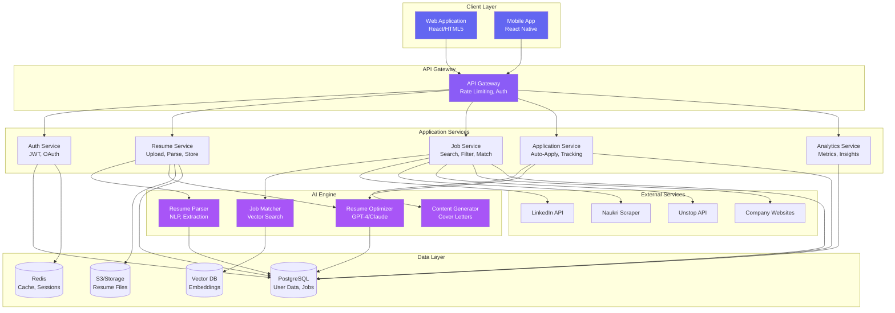

# JoBika - Technical Architecture

## System Architecture

---

## Database Schema

---

## User Flow Diagram

---

## Auto-Apply Pipeline

---

## Technology Stack Details

### Frontend
- **Framework**: React 18 with TypeScript (or Vanilla JS for MVP)
- **Styling**: Tailwind CSS / Vanilla CSS with CSS Variables
- **State Management**: Zustand / Context API
- **Routing**: React Router
- **Forms**: React Hook Form + Zod validation
- **Charts**: Chart.js / Recharts

### Backend
- **Runtime**: Node.js 20+ with Express.js
- **Language**: TypeScript
- **API**: RESTful + GraphQL (future)
- **Authentication**: JWT + OAuth 2.0 (Google, LinkedIn)
- **File Upload**: Multer + AWS S3

### AI/ML
- **Resume Parsing**: spaCy, PyResParser, or GPT-4 Vision
- **Content Generation**: OpenAI GPT-4 / Anthropic Claude
- **Embeddings**: OpenAI text-embedding-3 / Sentence Transformers
- **Vector Search**: Pinecone / Weaviate / pgvector

### Database
- **Primary DB**: PostgreSQL 15+
- **Cache**: Redis 7+
- **Vector Store**: Pinecone / pgvector extension
- **File Storage**: AWS S3 / Cloudflare R2

### Infrastructure
- **Hosting**: Vercel (Frontend) + Railway/Render (Backend)
- **CDN**: Cloudflare
- **Monitoring**: Sentry, LogRocket
- **Analytics**: PostHog, Mixpanel

### Job Scraping
- **Automation**: Puppeteer / Playwright
- **Proxies**: Bright Data / ScraperAPI
- **APIs**: LinkedIn API, Naukri API (if available)

---

## Security Architecture

### Security Measures
- **Data Encryption**: AES-256 for data at rest, TLS 1.3 for transit
- **Authentication**: JWT with refresh tokens, OAuth 2.0
- **Authorization**: Role-based access control (RBAC)
- **Input Validation**: Sanitize all user inputs
- **Rate Limiting**: Prevent abuse (100 req/min per user)
- **GDPR Compliance**: Data export, deletion, consent management
- **Audit Logs**: Track all sensitive operations

---

## Scalability Considerations

### Horizontal Scaling
- **Stateless Services**: All services are stateless for easy scaling
- **Load Balancing**: Nginx/AWS ALB for traffic distribution
- **Database Replication**: Read replicas for query performance

### Caching Strategy
- **Redis Cache**: Job listings (1 hour TTL), user sessions
- **CDN**: Static assets, resume templates
- **API Response Cache**: Frequently accessed data

### Performance Targets
- **Page Load**: < 2 seconds
- **API Response**: < 500ms (p95)
- **Resume Processing**: < 10 seconds
- **Job Matching**: < 3 seconds for 1000 jobs
