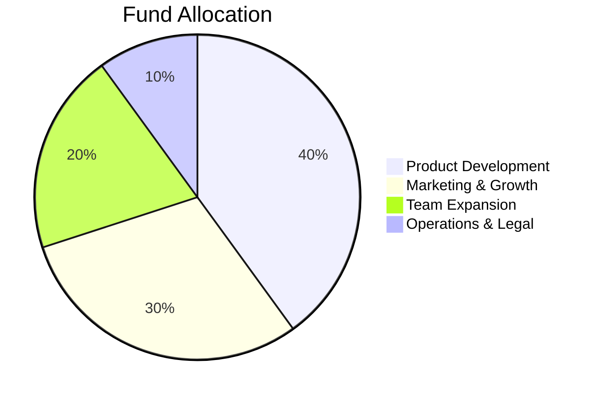

# JoBika - Investor Pitch Deck

---

## Slide 1: Cover

<div style="text-align: center; padding: 4rem 0;">

# **JoBika**
### AI-Powered Job Application Platform for India

**Reducing job application time from 1 hour to 2 minutes**

---

*Confidential - November 2025*

</div>

---

## Slide 2: The Problem

### Job Seekers Face Massive Inefficiencies

**📊 Key Statistics:**
- Average time per job application: **60+ minutes**
- Applications needed for 1 interview: **50-100**
- Total time investment: **50-100 hours**
- Success rate with generic resumes: **<2%**

**😰 Pain Points:**
1. **Manual Customization**: Tailoring resumes for each job is exhausting
2. **Poor Representation**: Candidates have skills but can't showcase them effectively
3. **Application Fatigue**: Burnout from repetitive form filling
4. **Market Gap**: No AI-powered solution for Indian job market

> **"I spent 3 months applying to jobs manually. It was soul-crushing."** - Typical job seeker

---

## Slide 3: The Solution

### JoBika: Your AI Job Application Copilot


**Core Value Proposition:**
- ⚡ **95% Time Savings**: 60 min → 2-5 min per application
- 🎯 **Higher Success Rate**: 20% more interview calls
- 🤖 **AI-Powered**: Smart resume optimization for each job
- 🇮🇳 **India-First**: Aggregates Naukri, LinkedIn, Unstop, company sites

---

## Slide 4: How It Works

### 3-Step Process

#### Step 1: Upload & Enhance
- User uploads existing resume (or enters manually)
- AI analyzes and enhances content
- Creates optimized base resume

#### Step 2: Smart Matching
- AI scans Indian job market (LinkedIn, Naukri, Unstop)
- Calculates match scores (skills, experience, location)
- Provides learning recommendations for gaps

#### Step 3: Auto-Apply
- AI customizes resume for each job
- Fills application forms automatically
- Submits and tracks status
- User approves or enables full automation

---

## Slide 5: Product Demo

### Dashboard Overview


**Key Features:**
- 📊 Application analytics (total, active, interviews, offers)
- 🎯 AI-recommended jobs with match scores
- 📝 Resume version management
- 📈 Success rate tracking

---

## Slide 6: Product Demo (Continued)

````carousel


<!-- slide -->


<!-- slide -->


<!-- slide -->


````

---

## Slide 7: Market Opportunity

### Massive & Growing Market

**📈 Total Addressable Market (TAM):**
- **India's workforce**: 500M+ people
- **Active job seekers**: 50M annually
- **White-collar job seekers**: 15M (our target)
- **Market size**: ₹7,500 Cr ($900M) at ₹500/user/year

**🎯 Serviceable Obtainable Market (SOM):**
- **Year 1 target**: 100K users
- **Revenue potential**: ₹5 Cr ($600K)

**📊 Market Trends:**
- AI adoption in HR tech: **45% CAGR**
- Indian job market growth: **12% annually**
- Remote work increasing demand: **3x since 2020**

---

## Slide 8: Business Model

### Freemium SaaS with Multiple Revenue Streams

| Tier | Price | Features | Target |
|------|-------|----------|--------|
| **Free** | ₹0 | 5 applications/month, basic AI | Students, first-time seekers |
| **Pro** | ₹499/mo | 50 applications, auto-apply, analytics | Active job seekers |
| **Enterprise** | ₹999/mo | Unlimited, priority support, team features | Professionals, agencies |

**Additional Revenue:**
1. **Sponsored Jobs**: Companies pay ₹5,000-₹20,000/month for visibility
2. **Premium Templates**: ₹299 one-time for designer resume templates
3. **Interview Coaching**: ₹1,999 add-on for AI interview prep

**Unit Economics:**
- Customer Acquisition Cost (CAC): ₹500
- Lifetime Value (LTV): ₹6,000 (12 months avg retention)
- **LTV:CAC Ratio**: 12:1 ✅

---

## Slide 9: Competitive Landscape

### We're Uniquely Positioned

| Feature | JoBika | LinkedIn | Naukri | Unstop |
|---------|--------|----------|--------|--------|
| AI Resume Customization | ✅ | ❌ | ❌ | ❌ |
| Auto-Apply | ✅ | ❌ | ❌ | ❌ |
| Multi-Version Resumes | ✅ | ❌ | ❌ | ❌ |
| Indian Market Focus | ✅ | ❌ | ✅ | ✅ |
| Learning Recommendations | ✅ | ✅ | ❌ | ❌ |
| **Time Saved** | **95%** | **0%** | **20%** | **20%** |

**Competitive Advantages:**
1. **AI-First Approach**: Not a job board, but an AI copilot
2. **End-to-End Automation**: From resume to application
3. **India-Specific**: Understands Indian job market nuances
4. **Ethical AI**: Recommends learning, doesn't fabricate skills

---

## Slide 10: Go-to-Market Strategy

### Phased Launch Approach

**Phase 1: Beta (Months 1-3)**
- Launch with 500 beta users (colleges, communities)
- Gather feedback and iterate
- Build case studies and testimonials

**Phase 2: Public Launch (Months 4-6)**
- Digital marketing (Google Ads, Meta, LinkedIn)
- Content marketing (blog, YouTube, LinkedIn)
- Partnerships with colleges and bootcamps

**Phase 3: Scale (Months 7-12)**
- Influencer partnerships (career coaches, YouTubers)
- Referral program (₹200 credit for both parties)
- Enterprise sales (placement agencies, consultancies)

**Acquisition Channels:**
- **Organic**: SEO, content marketing (40%)
- **Paid**: Google/Meta ads (30%)
- **Partnerships**: Colleges, bootcamps (20%)
- **Referrals**: Word of mouth (10%)

---

## Slide 11: Traction & Milestones

### Current Status: MVP Complete

**✅ Completed:**
- Product concept & market research
- Technical architecture designed
- MVP prototype built
- UI/UX mockups created

**🎯 6-Month Milestones:**
- **Month 1-2**: Beta launch with 500 users
- **Month 3-4**: Public launch, 5K users
- **Month 5-6**: 10K users, ₹5L MRR

**📈 12-Month Goals:**
- **Users**: 100,000 registered
- **Paying Customers**: 15,000 (15% conversion)
- **MRR**: ₹75L ($90K)
- **ARR**: ₹9 Cr ($1.08M)

---

## Slide 12: Financial Projections

### 3-Year Revenue Forecast

| Metric | Year 1 | Year 2 | Year 3 |
|--------|--------|--------|--------|
| **Users** | 100K | 500K | 2M |
| **Paying (15%)** | 15K | 75K | 300K |
| **ARPU** | ₹6,000 | ₹6,500 | ₹7,000 |
| **Revenue** | ₹9 Cr | ₹49 Cr | ₹210 Cr |
| **Gross Margin** | 75% | 80% | 82% |
| **Net Margin** | -20% | 15% | 30% |

**Cost Breakdown (Year 1):**
- Engineering & Product: 40%
- Sales & Marketing: 35%
- Operations: 15%
- G&A: 10%

**Break-even**: Month 18

---

## Slide 13: Team

### Experienced Founders with Domain Expertise

**👨‍💻 [Your Name] - CEO & Co-Founder**
- Background: [Your background]
- Skills: Product, AI/ML, Business Strategy

**👩‍💻 [Co-Founder Name] - CTO**
- Background: [Background]
- Skills: Full-stack development, System architecture

**🎯 Advisors:**
- **[Advisor 1]**: Former VP at LinkedIn India
- **[Advisor 2]**: AI/ML expert, ex-Google
- **[Advisor 3]**: HR Tech investor

**Hiring Plan (Year 1):**
- 2 Full-stack Engineers
- 1 AI/ML Engineer
- 1 Product Designer
- 1 Growth Marketer

---

## Slide 14: Use of Funds

### Seeking ₹2 Cr ($240K) Seed Round

**Allocation:**



**Detailed Breakdown:**
- **Product Development (40%)**: ₹80L
  - AI model training and optimization
  - Mobile app development
  - Infrastructure and scaling
  
- **Marketing & Growth (30%)**: ₹60L
  - Digital advertising campaigns
  - Content creation and SEO
  - Partnership development
  
- **Team Expansion (20%)**: ₹40L
  - Engineering hires
  - Product and design
  - Customer success
  
- **Operations & Legal (10%)**: ₹20L
  - Legal compliance
  - Office and admin
  - Contingency

**Runway**: 18 months

---

## Slide 15: The Ask

<div style="text-align: center; padding: 3rem 0;">

# **Seeking ₹2 Cr Seed Funding**

### In Exchange for 15% Equity

**What You Get:**
- 🚀 Entry into massive ₹7,500 Cr market
- 🤖 AI-first product with strong moat
- 📈 Clear path to profitability (18 months)
- 💪 Experienced team with domain expertise

**Next Steps:**
1. Due diligence and term sheet
2. Beta launch (30 days)
3. Fundraise close (60 days)

---

### Let's Transform Job Hunting in India

**Contact:**
- 📧 Email: founders@jobika.in
- 🌐 Website: jobika.in
- 📱 Phone: +91 [Your Number]

</div>

---

## Appendix: Risk Mitigation

### Key Risks & Mitigation Strategies

**Risk 1: AI Accuracy**
- *Mitigation*: Human-in-the-loop for critical decisions, continuous model training

**Risk 2: Job Platform API Access**
- *Mitigation*: Web scraping fallback, direct partnerships with platforms

**Risk 3: User Adoption**
- *Mitigation*: Freemium model, strong onboarding, referral incentives

**Risk 4: Competition**
- *Mitigation*: First-mover advantage in India, AI moat, network effects

**Risk 5: Regulatory Changes**
- *Mitigation*: Legal compliance team, data privacy focus, transparent AI

---

## Appendix: Technical Architecture

See [ARCHITECTURE.md](file:///C:/Users/Student/Desktop/JoBika/docs/ARCHITECTURE.md) for detailed technical documentation.

**Key Technologies:**
- **Frontend**: React, TypeScript
- **Backend**: Node.js, PostgreSQL
- **AI**: GPT-4, Claude, Vector embeddings
- **Infrastructure**: AWS, Vercel

**Scalability:**
- Horizontal scaling with load balancers
- Microservices architecture
- Caching with Redis
- CDN for static assets
